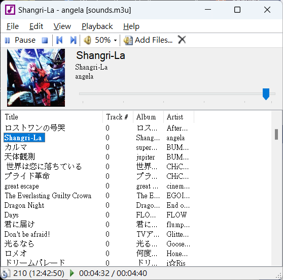

# Sounds

A minimalist music player for Windows. 

- Written in C#.
- No music library is managed by the application; that's the file system and file metadata's responsibility. Just add (or drag) the files into the playlist and you're good to go.
- Uses the system libraries to play music, and TagLib to cut through file metadata.
- No skins, plugins, or any other funny business. You get what you see.

# Updates in this fork

- Now builds in .NET Framework 4.8
- Fixes a bug where only the first file was being added while loading an m3u playlist
- Implementation of Repeat
- Fixes on About Page
- Registry savings 
- Bunch of UX improvements(like time, flikering, etc)
- Discord Rich Presence
- Windows context menu integration
- Window Snapping

# To do
- Add a playlist library view
- Publish "Now Playing" to Discord Rich Presence

# Thanks
Original: https://cmpct.info/~calvin/Sounds/